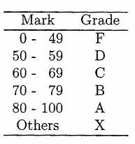

# **Grade Converter**

## Objective
---
 

- Write a character-valued method convertToGrade that has an int parameter mark. The method should return the grade that corresponds to mark according to the following table.

&nbsp;&nbsp;&nbsp;&nbsp;&nbsp;&nbsp;&nbsp;&nbsp;&nbsp;&nbsp;

---
### **Other Requirements**

- Used Python 3

  

***Made on May 13th, 2023***\
***By: Aaron Prince Anu***

*Temporary?*